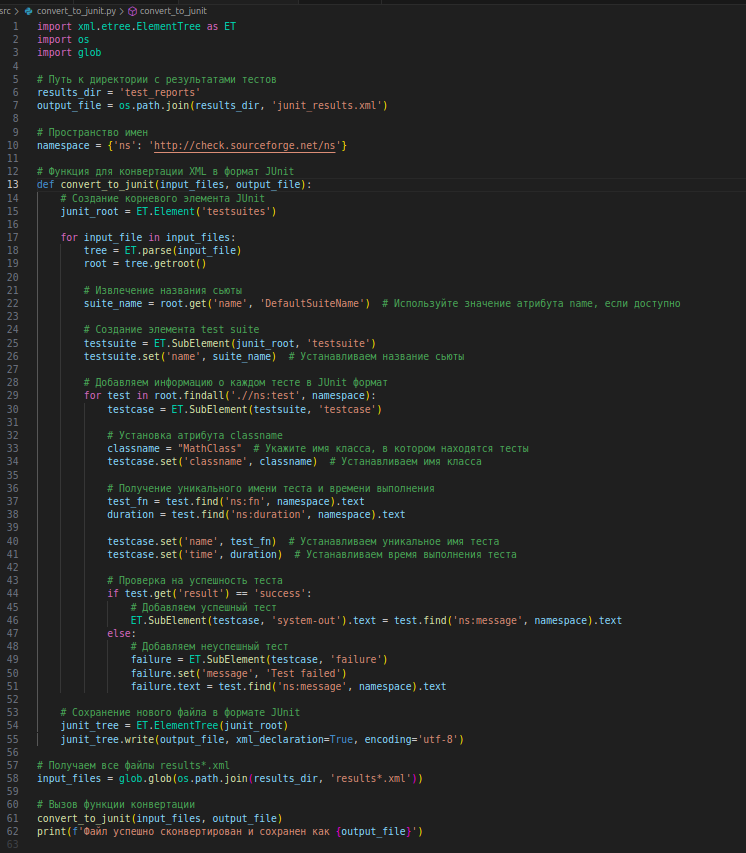

# Jenkins-MathLib-Logger

## В чем основная идея?
Aвтоматизировать сборку и тестирование проекта "s21_math" с помощью Jenkins

### Из чего состоит проект "s21_math"?
В проекте представлена реализация функций библиотеки math.h
```
abs
acos
asin
atan
ceil
cos
exp
fabs
floor
fmod
log
pow
sin
sqrt
tan
```
на языке Си, для каждой функции есть тесты для каждой функции, написанные с помощью библиотеки check.h, `src/unit_tests'

### Процесс реализации
1. Добавить вывод библиотеки check.h в .xml в makefile (цель тест)


в файле `all_tests_s21.c` добавить вывод всех suite в .xml


2. Добавить конвертацию полученных results*.xml в формат JUnit для Jenkins c помощью питон скрипта `convert_to_junit.py`


3. Написание Jenkinsfile со стадиями (Build, Test, Publish Test Results)


4. Добавление webhook на GitHub для автоматизации сборки по push


5. Вывод результатов тестов в Jenkins после каждой сборки


